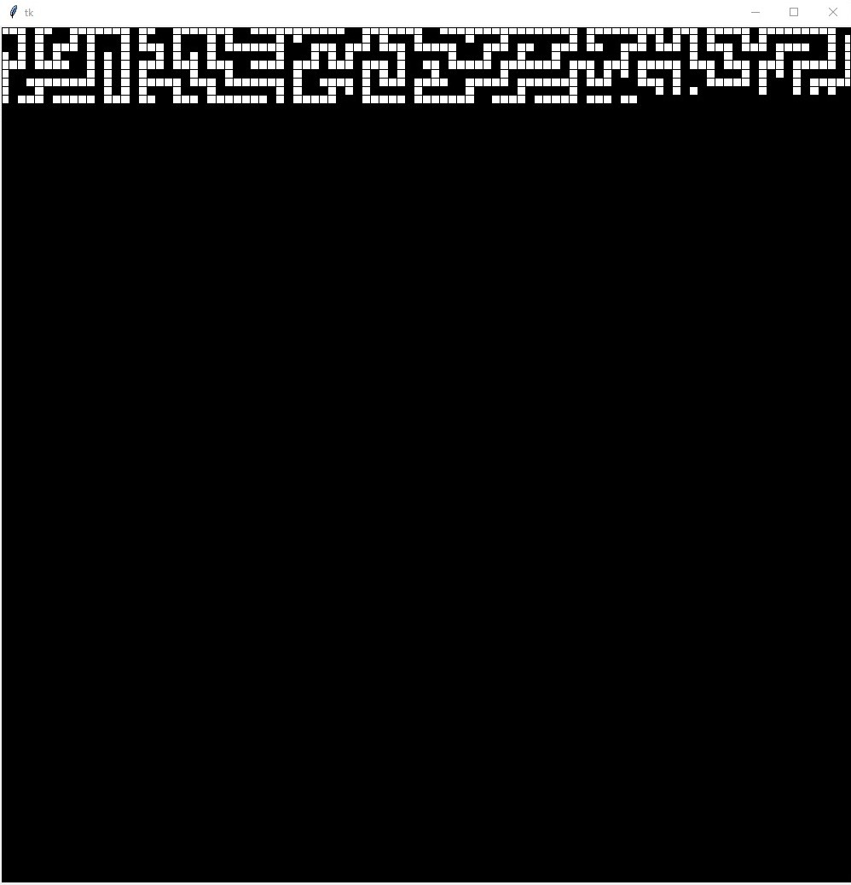
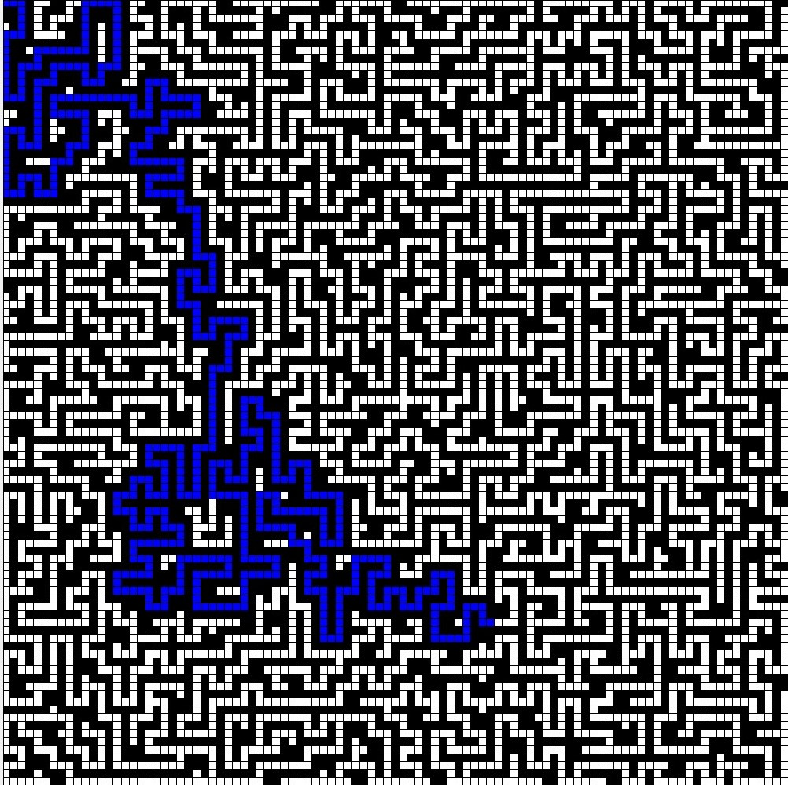
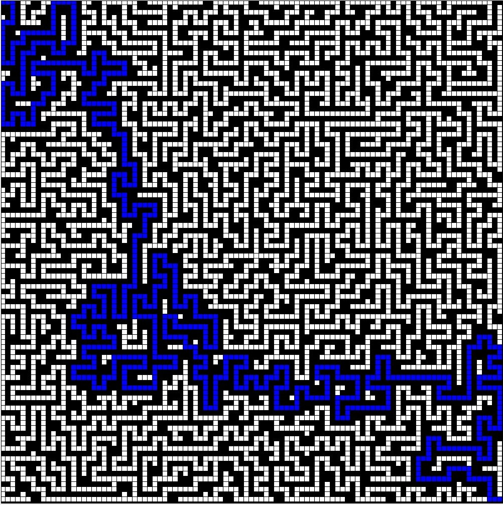

# Labyrinthe
## The Goal

The goal of the labyrinth is to go from point A to point B using a single path.

## Description

My labyrinth is generated automatically thanks to a given number of boxes.
When my game is launched, we will be able to witness the creation of the labyrinth.
Finally, to find the exit, press the R key for the computer to look for point B.

# Images

#### Creation of the labyrinth

#### The computer searches for the exit of the labyrinth

#### Exit found

